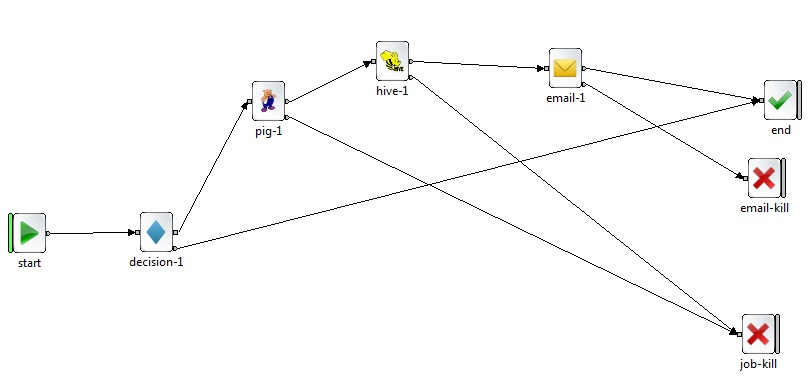

# Oozie Example
## Oozie Overview
Oozie is an Open Source Java Web-Application available under Apache license 2.0. It is responsible for triggering the workflow actions, which in turn uses the Hadoop execution engine to actually execute the task. Hence, Oozie is able to leverage the existing Hadoop machinery for load balancing, fail-over, etc.

Oozie detects completion of tasks through callback and polling. When Oozie starts a task, it provides a unique callback HTTP URL to the task, and notifies that URL when it is complete. If the task fails to invoke the callback URL, Oozie can poll the task for completion.

Following three types of jobs are common in Oozie −
*   Oozie Workflow Jobs − These are represented as Directed Acyclic Graphs (DAGs) to specify a sequence of actions to be executed.

*   Oozie Coordinator Jobs − These consist of workflow jobs triggered by time and data availability.

*   Oozie Bundle − These can be referred to as a package of multiple coordinator and workflow jobs.

## Workflow Example
Below is an example of Oozie workflow.
```xml
<?xml version="1.0" encoding="UTF-8"?>

<workflow-app xmlns="uri:oozie:workflow:0.4" name="workflow.xml">
  <start to="decision-1"/>
  <kill name="email-kill">
    <message>Email failed, error message[${wf:errorMessage(wf:lastErrorNode())}</message>
  </kill>
  <action name="hive-1">
    <hive xmlns="uri:oozie:hive-action:0.5">
      <job-tracker>${jobtracker}</job-tracker>
      <name-node>${namenode}</name-node>
      <job-xml>/RADAR/hive-site.xml</job-xml>
      <script>/RADAR/tmp/oozie_hive_test.hive</script>
    </hive>
    <ok to="email-1"/>
    <error to="job-kill"/>
  </action>
  <action name="pig-1">
    <pig>
      <job-tracker>${jobtracker}</job-tracker>
      <name-node>${namenode}</name-node>
      <prepare>
        <delete path="/RADAR/tmp/pig_out"/>
      </prepare>
      <script>/RADAR/tmp/oozie_pig_test.pig</script>
    </pig>
    <ok to="hive-1"/>
    <error to="job-kill"/>
  </action>
  <action name="email-1">
    <email xmlns="uri:oozie:email-action:0.2">
      <to>chen-gangh@hpe.com</to>
      <subject>Email notifications for ${wf:id()}</subject>
      <body>The wf ${wf:id()} abnormally completed.</body>
    </email>
    <ok to="end"/>
    <error to="email-kill"/>
  </action>
  <kill name="job-kill">
    <message>Script failed, error message[${wf:errorMessage(wf:lastErrorNode())}</message>
  </kill>
  <decision name="decision-1">
    <switch>
      <case to="pig-1">${fs:exists('/RADAR/tmp/pig_test_data.dat') eq 'true'}</case>
      <default to="end"/>
    </switch>
  </decision>
  <end name="end"/>
</workflow-app>
<!--
<workflow>
  <node name="start" x="-159" y="265"/>
  <node name="email-kill" x="576" y="210"/>
  <node name="end" x="592" y="132"/>
  <node name="hive-1" x="190" y="94"/>
  <node name="pig-1" x="58" y="126"/>
  <node name="email-1" x="377" y="100"/>
  <node name="job-kill" x="570" y="366"/>
  <node name="decision-1" x="-32" y="264"/>
</workflow>-->
```
Don't be in panic about Oozie configuration, and you might use [Eclipse plugin](http://marketplace.eclipse.org/content/oozie-eclipse-plugin?mpc=true&mpc_state=) to visualize or develop job scheduler as below figure shown. It makes it more easier.  


There are six action types.
*  Hive which is used to trigger Hive script where is defined in script tag. In this example, script is specified as "/RADAR/tmp/oozie_hive_test.hive". Note that this Hive script is located in HDFS. Namenode and jobtracker are set by variables which are declared in another configuration file. We would give details in next section.
*  Pig. it's similiar with Hive. Note we must set _prepare_ configuration.
*  Email.
*  Decision. It evaluate condition tags and determine whether to run this task or not. In this example, if the file exists in _/RADAR/tmp/pig_test_data.dat_, run action "pig-1". Otherwise, run default action "end".
*  end
*  kill

As the example shown, we might define variables in property file. The following is an example. These variables will be evaluted in workflow materialization.
```sh
# proprties
namenode = maprfs:///
jobtracker = maprfs:///
script_name_external = hdfs_path_of_script/external.hive
script_name_orc=hdfs_path_of_script/orc.hive
script_name_copy=hdfs_path_of_script/Copydata.hive
database = database_name
shell_script = /RADAR/tmp/oozie_shell_text.sh
oozie.use.system.libpath = true
workflow_xml_path = ${namenode}RADAR/tmp
workflow_xml = ${workflow_xml_path}/a.xml
oozie.coord.application.path=${namenode}RADAR/tmp
```

Once we finish developing Oozie workflow configuration, we might run this workflow. Note that propery file should be located in local file system.
```sh
oozie job --oozie http://g4t7507.houston.hpecorp.net:11000/oozie -D oozie.wf.application.path=maprfs:///RADAR/tmp/workflow.xml --config /opt/apps/RADAR/tmp/job.properties -run
```

## Coordinator
Coordinator applications allow users to schedule complex workflows, including workflows that are scheduled regularly. Oozie Coordinator models the workflow execution triggers in the form of time, data or event predicates. The workflow job mentioned inside the Coordinator is started only after the given conditions are satisfied. The below is an example of coordinator.
```xml
<coordinator-app xmlns = "uri:oozie:coordinator:0.2" name =
   "coord_test" frequency="${coord:minutes(45)}"
  start="2017-02-10T06:00Z" end="2017-02-26T23:25Z" timezone="GMT">

   <controls>
      <timeout>1</timeout>
      <concurrency>1</concurrency>
      <execution>FIFO</execution>
      <throttle>1</throttle>
   </controls>

   <action>
      <workflow>
         <app-path>${workflow_xml}</app-path>
      </workflow>
   </action>

</coordinator-app>
```
It schedule the workflow every 45 minutes from start="2017-02-10T06:00Z" end="2017-02-26T23:25Z". And the below is instruction to run the Coordinator.
```sh
oozie job --oozie http://g4t7507.houston.hpecorp.net:11000/oozie --config /opt/apps/RADAR/tmp/job.properties -run
oozie job --oozie http://g4t7507.houston.hpecorp.net:11000/oozie -kill 0000032-170119073032394-oozie-mapr-C
```
